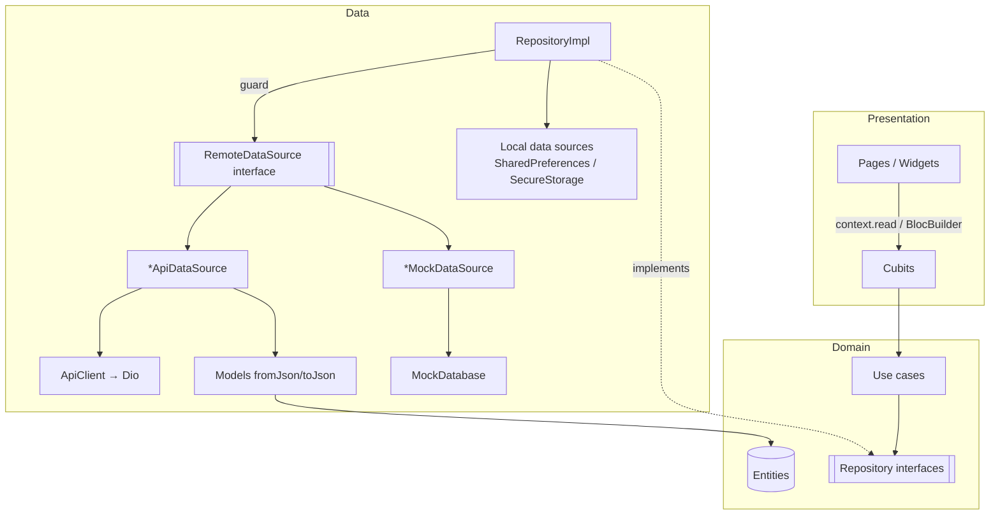
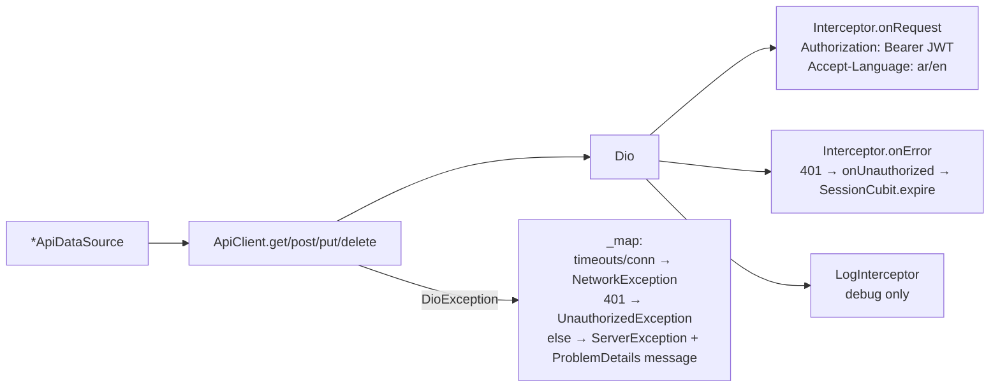
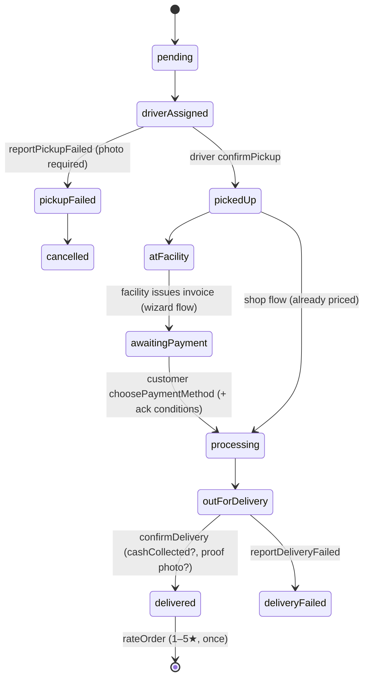
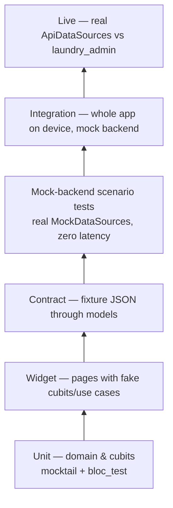

# laundry_app — Architecture, Flows & Tests

A reviewer's guide to the Flutter client: how the code is layered, how the
layers talk to each other, what each feature does end to end, and what the
test suite actually proves.

> Snapshot: Flutter 3.47 / Dart ^3.13, `flutter_bloc` 9, `get_it` 9,
> `go_router` 18, `dio` 5. ~31k lines under `lib/`, `test/` and
> `integration_test/`. At the time of writing, `flutter test --exclude-tags live`
> ran **139 tests, all passing**, and `flutter analyze` reported 20 issues
> (19 lint infos + 1 unused-import warning in a test, no errors).

---

## Contents

1. [The app in one paragraph](#1-the-app-in-one-paragraph)
2. [Folder layout](#2-folder-layout)
3. [The layers and the dependency rule](#3-the-layers-and-the-dependency-rule)
4. [Core building blocks](#4-core-building-blocks)
5. [One request, top to bottom](#5-one-request-top-to-bottom)
6. [How errors travel](#6-how-errors-travel)
7. [Composition root & object lifetimes](#7-composition-root--object-lifetimes)
8. [Navigation & the role guard](#8-navigation--the-role-guard)
9. [How features talk to each other](#9-how-features-talk-to-each-other)
10. [Feature walkthroughs](#10-feature-walkthroughs)
11. [Mock backend vs real API](#11-mock-backend-vs-real-api)
12. [Tests](#12-tests)
13. [Review notes](#13-review-notes)
14. [Conventions cheat sheet](#14-conventions-cheat-sheet)

---

## 1. The app in one paragraph

One app, two roles. A **customer** signs in by phone + OTP, completes a
profile (name + first pickup address), then books laundry in one of two ways:
the **order wizard** (pick categories → service per category → tier → pickup
& delivery slots + address; the facility prices it later and the customer
pays from the invoice), or the **shop** (a priced product grid → cart →
checkout, priced and paid up front). They track orders, pay, rate, and get
invoice help (FAQ → assistant → human). A **driver** signs in the same way
and sees today's pickups/deliveries, confirms or reports failures (with
photos), and toggles availability. Staff/admin accounts are refused — they
use the web portal (`laundry_admin`). Arabic (default) and English, light and
dark themes.

---

## 2. Folder layout

```
lib/
├── main.dart                 # binding → configureDependencies() → runApp
├── app.dart                  # MaterialApp.router + app-wide BlocProviders
├── core/                     # shared, feature-agnostic infrastructure
│   ├── config/app_config.dart        # --dart-define switches (mock/real, base URL…)
│   ├── di/injection.dart             # composition root (GetIt `sl`)
│   ├── error/                        # exceptions (data) · failures (domain) · guard()
│   ├── result/result.dart            # sealed Result<T> = Ok | Err
│   ├── usecase/usecase.dart          # UseCase<T, Params> interface + NoParams
│   ├── network/                      # Dio factory, ApiClient, endpoint constants
│   ├── storage/token_storage.dart    # JWT in secure storage (memory-cached)
│   ├── mock/mock_database.dart       # in-memory backend used when USE_MOCK_API
│   ├── router/                       # GoRouter, Routes, role redirect, refresh
│   ├── locale/ · theme/              # LocaleCubit, ThemeCubit (SharedPreferences)
│   ├── l10n/l10n.dart                # context.l10n + Failure.localized()
│   ├── design/                       # "Care Label" design system (tokens, components)
│   └── utils/                        # digit normalisation, formatters
├── features/
│   └── <feature>/
│       ├── <feature>_injection.dart  # registers this feature in GetIt
│       ├── domain/
│       │   ├── entities/             # plain Dart + Equatable, no Flutter
│       │   ├── repositories/         # abstract interfaces returning Result<T>
│       │   └── usecases/             # one operation each; validation lives here
│       ├── data/
│       │   ├── datasources/          # *RemoteDataSource interface + Api + Mock impls
│       │   ├── models/               # static fromJson/toJson ↔ entities
│       │   └── repositories/         # *RepositoryImpl: guard() around data sources
│       └── presentation/
│           ├── cubit/                # state + Cubit, depends on use cases only
│           ├── pages/                # route targets; create cubits via BlocProvider
│           ├── widgets/
│           └── utils/                # UI-only extensions (status colours, icons…)
└── l10n/                     # app_ar.arb / app_en.arb + generated localizations
```

Features: `auth`, `addresses`, `orders` (catalogue, customer orders, driver
tasks), `shop` (product grid, cart, checkout), `support`, `notifications`.

---

## 3. The layers and the dependency rule



**The rule, and how well it holds:**

| Layer | May import | Verified |
|---|---|---|
| `domain` | `core/result`, `core/error`, `core/usecase`, `core/utils`, other features' **domain** | No `package:flutter`, no `data/`, no `presentation/` import anywhere under `features/*/domain`. ✅ |
| `data` | its own `domain`, `core/network`, `core/storage`, `core/mock`, other features' `data/models` | No `presentation/` import under `features/*/data`. ✅ |
| `presentation` | use cases + entities, `core/l10n`, `core/design`, `core/router` | Cubits depend on use cases, never on repositories. Pages resolve cubits from `sl`. ✅ (two cubits import a design token — see §13) |

Cross-feature coupling is **domain-to-domain only**:

- `auth` → `addresses` (`CompleteProfile` writes the first address)
- `orders` → `addresses` (`LaundryOrder.address`, `DriverTask.address`)
- `shop` → `orders` (`Product`, `ServiceTier`, `CatalogRepository`, `CreateOrder`) and `addresses`

This is also why registration order in `injection.dart` matters
(`addresses` → `auth` → `orders` → `shop` → …); `shop_injection.dart` says so
explicitly.

---

## 4. Core building blocks

These five pieces are the contract every feature follows. Read them first;
everything else is repetition of the pattern.

### 4.1 `Result<T>` — `lib/core/result/result.dart`

```dart
sealed class Result<T> { fold(onErr:, onOk:) · isOk · valueOrNull · failureOrNull · map() }
final class Ok<T>  extends Result<T> { final T value; }
final class Err<T> extends Result<T> { final Failure failure; }
```

A hand-rolled `Either<Failure, T>`. Being `sealed`, callers can
pattern-match exhaustively (`case Ok(:final value)`, `case Err(failure: ServerFailure(statusCode: 400))`),
which the code uses heavily instead of `fold` when it needs to branch on a
specific failure.

### 4.2 Exceptions vs Failures — `lib/core/error/`

Two parallel vocabularies, one per side of the repository boundary:

| Data layer throws (`exceptions.dart`) | Domain sees (`failures.dart`) |
|---|---|
| `ServerException(statusCode, message)` | `ServerFailure(statusCode, message)` |
| `UnauthorizedException` | `UnauthorizedFailure` |
| `NetworkException` | `NetworkFailure` |
| `CacheException` | `CacheFailure` |
| *anything else* | `UnexpectedFailure(e.toString())` |
| — (raised by use cases) | `InputFailure(InputError.invalidPhone \| invalidOtp \| requiredField)` |
| — (business rules) | `UnsupportedRoleFailure`, `LastAddressFailure` |

`Failure` is `sealed` + `Equatable`, so cubit states compare cleanly and
`bloc_test` expectations can use `const` failures.

### 4.3 `guard()` — `lib/core/error/guard.dart`

```dart
Future<Result<T>> guard<T>(Future<T> Function() body)
```

The **only** place exceptions become failures. Every repository method is a
one-liner around it, e.g.

```dart
Future<Result<List<Address>>> getAddresses() => guard(_remote.getAddresses);
```

Repositories add behaviour on top only where the domain needs it (see
`AuthRepositoryImpl.verifyOtp` mapping a 400 to `InputFailure(invalidOtp)`).

### 4.4 `UseCase<T, Params>` — `lib/core/usecase/usecase.dart`

```dart
abstract interface class UseCase<T, Params> { Future<Result<T>> call(Params params); }
```

- Params are either an `Equatable` class (`VerifyOtpParams`,
  `StartSignInParams`, `CompleteProfileParams`, `NewOrderParams`) or a Dart
  **record** (`({String orderId, int stars, String? comment})`). Records keep
  small use cases cheap; classes are used where equality in mocks/tests or
  documentation matters.
- Most use cases are pass-throughs. The ones with **real logic** are where
  to focus a review:
  `StartSignIn`, `VerifyOtp`, `CheckPhone`, `RequestOtp`, `CompleteProfile`
  (auth); `AddAddress`, `UpdateAddress`, `DeleteAddress` (addresses).
- `GetSavedAccount` is deliberately **synchronous** and not a `UseCase` —
  the login screen needs the answer in its first frame.

### 4.5 Network — `lib/core/network/`



- `createDio` (`dio_factory.dart`) receives its collaborators as **functions**
  (`languageCode: () => …`, `onUnauthorized: () => …`) so the network layer
  never imports a cubit — the composition root injects the callbacks.
- `ApiClient` returns decoded JSON (`dynamic`); each data source casts and
  hands it to a model's `fromJson`.
- `ApiClient._extractMessage` understands ASP.NET-style ProblemDetails
  (`detail` / `message` / `title`); `FailureMessage.localized` shows that
  server text for a `ServerFailure` that carries one, otherwise a localized
  generic message.
- `ApiEndpoints` is split into "Phase 1 (agreed)" and "Proposed" groups — a
  useful signal of which endpoints are still negotiable with the backend.

### 4.6 Storage

| What | Where | Why |
|---|---|---|
| JWT | `SecureTokenStorage` → `flutter_secure_storage`, cached in memory after first read | Read on every request by the interceptor |
| Language, theme | `SharedPreferences` via `LocaleCubit` / `ThemeCubit` | Needed synchronously at startup |
| Last signed-in account (name + phone) | `SavedAccountLocalDataSource` → SharedPreferences | "Welcome back" one-tap login; not a secret (OTP still required) |
| Cart | `CartLocalDataSource` → SharedPreferences (`cart_v1`: product ids → qty, tier id) | Survives restarts; re-resolved against the live catalogue on load |

### 4.7 Presentation conventions

- **Cubits only, no Blocs.** State classes are `Equatable`.
- Two state styles:
  - **Rebuild-the-state** (`OrdersState(...)`, `OrderTrackingState(...)`)
    for small screens — every emit constructs a fresh state, which also
    naturally clears `failure`.
  - **`copyWith` with a sentinel** for big forms (`OrderWizardState`,
    `CheckoutState`, `CatalogState`): nullable fields default to a private
    `const _unset = Object()` so callers can pass `null` to clear a value.
    `LoginState`/`OtpState` use `ValueGetter<T?>` for the same purpose.
- **One-shot effects as state fields** consumed by a `BlocListener`:
  `LoginState.codeSentTo` (+ `acknowledge()`), `OtpState.user`,
  `OtpState.resent`, `OrderWizardState.created`, `TaskDetailState.done`,
  `AddressFormState.outcome` (a sealed `AddressSaved | AddressDeleted`).
- Pages create cubits with `BlocProvider(create: (_) => sl<X>(param1: …))`;
  shared app-level cubits are provided with `BlocProvider.value`.

---

## 5. One request, top to bottom

**Login → OTP → signed-in home**, the flow that touches every layer and the
router:

```mermaid
sequenceDiagram
  autonumber
  actor U as User
  participant LP as LoginPage
  participant LC as LoginCubit
  participant SS as StartSignIn
  participant RO as RequestOtp
  participant AR as AuthRepositoryImpl
  participant DS as AuthRemoteDataSource
  participant OP as OtpPage / OtpCubit
  participant VO as VerifyOtp
  participant SC as SessionCubit
  participant GR as GoRouter.redirect

  U->>LP: types number
  LP->>LC: phoneChanged(raw)
  LC->>AR: CheckPhone → isRegistered(phone)
  AR->>DS: guard(isRegistered(e164))
  DS-->>LC: Ok(true/false) → phoneStatus registered/unregistered
  U->>LP: taps Log in / Verify
  LC->>SS: StartSignIn(phone, fullName?)
  SS->>SS: validate phone, then name (screen order)
  SS->>RO: RequestOtp(phone)
  RO->>AR: requestOtp(PhoneNumber)
  AR-->>LC: Ok(SignInRequest)
  LC-->>LP: state.codeSentTo = request
  LP->>OP: context.push(/login/otp, extra: SignInRequest); acknowledge()
  U->>OP: enters 4 digits → codeChanged → verify()
  OP->>VO: VerifyOtpParams(phone, code, fullName)
  VO->>VO: normalise digits, regex check
  VO->>AR: verifyOtp(...)
  AR->>DS: verifyOtp → {token, user}
  AR->>AR: TokenStorage.write(token); _remember(user) → SavedAccount
  AR-->>VO: Ok(user) / 400 → InputFailure(invalidOtp)
  VO->>VO: staff? → logout + UnsupportedRoleFailure
  VO->>AR: new account with typed name → updateProfile(name)
  VO-->>OP: Ok(user) → state.user
  OP->>SC: listener: signedIn(user)
  SC-->>GR: stream emits → StreamRefreshListenable.notifyListeners()
  GR->>GR: resolveRedirect(): customer w/o profile → /complete-profile<br/>customer → /customer · driver → /driver
```

Key takeaways:

- **Navigation after auth is never imperative.** Nothing calls
  `context.go('/customer')`. The OTP page only tells `SessionCubit`; the
  router re-evaluates `resolveRedirect` because it listens to the session
  and locale streams.
- **Validation lives in use cases**, not widgets (`StartSignIn` checks the
  phone before the name to match the on-screen order; `VerifyOtp` accepts
  Arabic-Indic digits).
- **The repository owns side-effects of a successful call** (persist the JWT,
  refresh the saved account).

---

## 6. How errors travel

```mermaid
flowchart LR
  A[Dio error / thrown TypeError] --> B[ApiClient._map<br/>→ *Exception]
  B --> C[guard() → Err(Failure)]
  C --> D{Repository special-case?}
  D -- "verifyOtp 400" --> E[InputFailure(invalidOtp)]
  D -- "restoreSession 401" --> F[clear token → Ok(null)]
  D -- no --> G[Err(Failure)]
  E & F & G --> H[Use case may add its own:<br/>InputFailure / UnsupportedRole / LastAddress]
  H --> I[Cubit puts Failure in state]
  I --> J[Page: failure.localized(l10n)<br/>SnackBar / inline error / ErrorView+retry]
```

A **401 on any authenticated call** takes a second, parallel path:
`dio onError` → `onUnauthorized()` → `SessionCubit.expire()` → token cleared →
`SessionUnauthenticated(expired: true)` → router sends the user to `/login`,
and `_SessionExpiryListener` in `app.dart` shows the "session expired"
snackbar. `expire()` is a no-op unless the user is currently authenticated,
so a 401 during session restore at startup doesn't double-handle.

---

## 7. Composition root & object lifetimes

`configureDependencies()` (`lib/core/di/injection.dart`) runs **before**
`runApp`:

1. `SharedPreferences` (awaited), `TokenStorage`, `LocaleCubit`,
   `ThemeCubit`, `MockDatabase`, `ApiClient` (Dio with the interceptor
   callbacks wired to `LocaleCubit` / `SessionCubit`).
2. Each feature's `register<Feature>Feature(sl)`.
3. `GoRouter` (depends on `SessionCubit` + `LocaleCubit`).
4. `await sl<SessionCubit>().restore()` — so the first frame already knows
   whether a JWT is valid.

Each feature file picks the data source once, at registration:

```dart
..registerLazySingleton<AuthRemoteDataSource>(
  () => AppConfig.useMockApi ? AuthMockDataSource(sl(), sl()) : AuthApiDataSource(sl()),
)
```

| Kind | Lifetime | Examples |
|---|---|---|
| Infrastructure | lazy singleton | `ApiClient`, `TokenStorage`, `MockDatabase`, `GoRouter` |
| Data sources, repositories | lazy singleton | every `*DataSource`, every `*RepositoryImpl` |
| Use cases | factory (stateless, cheap) | `VerifyOtp`, `CreateOrder`, … |
| App-wide cubits | lazy singleton, provided with `BlocProvider.value` in `app.dart` | `SessionCubit`, `LocaleCubit`, `ThemeCubit` |
| Shared feature cubit | lazy singleton | `CartCubit` (Home, Shop and Checkout are sibling routes with no common provider) |
| Screen cubits | factory / `registerFactoryParam` — one per page visit, closed by `BlocProvider` | `LoginCubit`, `OrderWizardCubit(param1: reorderFrom, param2: categoryId)`, `OrderTrackingCubit(param1: orderId)`, `TaskDetailCubit(param1: orderId)`, `CheckoutCubit(param1: reorderFrom)`, `AssistantCubit(param1: orderId)`, `AddressFormCubit(param1: editing)` |
| Built in the page | — | `OtpCubit` (constructed directly in `OtpPage` from `sl()` use cases; the only cubit not registered in DI) |

Because pages resolve cubits from `sl`, **widget tests override a cubit by
registering it in `sl` in `setUp` and calling `sl.reset` in `tearDown`** —
see §12.

---

## 8. Navigation & the role guard

Routes live in `lib/core/router/routes.dart`; the tree is in
`app_router.dart`.

```
/splash                      SplashPage (restoring session, retry on failure)
/language                    LanguagePage (first launch only)
/login                       LoginPage
  └─ otp                     OtpPage            (extra: SignInRequest, else → /login)
/complete-profile            CompleteProfilePage
/addresses                   AddressesPage
  ├─ new                     AddressFormPage
  └─ :id/edit                AddressFormPage    (extra: Address, else → /addresses)
/customer                    CustomerHomeShell  (tabs: home, orders, …, account)
/orders/new                  OrderWizardPage    (extra: LaundryOrder → reorder | (category: id))
/shop                        ProductGridPage    (extra: (category: id))
/checkout                    CheckoutPage       (extra: LaundryOrder → reorder)
/orders/:id                  OrderTrackingPage
  └─ invoice                 InvoicePage
      └─ help                InvoiceHelpPage
          └─ assistant       AssistantPage
/notifications               NotificationsPage  (both roles)
/driver                      DriverHomeShell    (tabs: tasks, history, account)
/driver/pickup/:orderId      PickupDetailPage
/driver/delivery/:orderId    DeliveryDetailPage
```

`resolveRedirect` is a **pure top-level function** (hence directly unit
tested). In order:

1. `SessionUnknown` → stay on `/splash`.
2. No language chosen → `/language`.
3. `SessionUnauthenticated` → only `/login` and `/login/otp` allowed.
4. `SessionAuthenticated`:
   - customer with `profileCompleted == false` → `/complete-profile`;
   - on an entry point (splash/language/login/otp/complete-profile) → role home;
   - a driver in a customer prefix (`/customer`, `/orders`, `/addresses`,
     `/shop`, `/checkout`) or a customer under `/driver` → role home;
   - `/notifications` is shared.

Typed `extra` payloads use a **record** for "category chosen on Home"
(`(category: id)`) and the entity itself for reorders; routes that require an
`extra` redirect away when it's missing (e.g. a cold deep link to
`/login/otp`).

---

## 9. How features talk to each other

There is no event bus. Features communicate through four mechanisms:

| Mechanism | Where | Example |
|---|---|---|
| **Shared domain types / use cases** | domain layer | `OrderWizardCubit` takes `GetAddresses` from `addresses`; `CheckoutCubit` takes `CreateOrder`, `GetProducts` from `orders` |
| **App-wide `SessionCubit`** | presentation, provided at the root | `OtpPage` → `signedIn(user)`; `CompleteProfilePage` → `userUpdated(user)`; `AccountPage` → `logout()`; Dio → `expire()`; the router listens |
| **Shared singleton cubit** | `CartCubit` | Product grid adds, the Home cart button reads, `CheckoutCubit` reads `_cart.state` and calls `setTier`, `loadFrom`, `clear` |
| **Refresh on return** | pages | `await context.push(...); await cubit.load();` — Home reloads `OrdersCubit` after the wizard/shop/order detail; addresses reload after the form; the driver list reloads after a task detail |

The "refresh on return" pattern is simple and explicit, but it means data is
only as fresh as the last push/pop or pull-to-refresh — there's no polling
or push channel yet.

---

## 10. Feature walkthroughs

### 10.1 `auth`

**Purpose:** language pick, phone+OTP sign-in/sign-up, saved-account
one-tap login, first-login profile completion, session restore/expiry,
logout.

| Layer | Pieces |
|---|---|
| Entities | `AppUser` (+ `UserRole.customer/driver/staff`, `profileCompleted`), `PhoneNumber` (value object; parses `05…`, `+971…`, `00971…`, Arabic-Indic digits; exposes `e164` / `formatted`), `SavedAccount`, `SignInRequest` |
| Use cases | `CheckPhone`, `RequestOtp`, `StartSignIn`, `VerifyOtp`, `RestoreSession`, `Logout`, `CompleteProfile`, `GetSavedAccount` |
| Data | `AuthApiDataSource` (`/api/auth/lookup`, `request-otp`, `verify-otp`, `/api/me`, `/api/me/profile`), `AuthMockDataSource`, `SavedAccountLocalDataSource`, `AuthRepositoryImpl` |
| Cubits | `SessionCubit` (sealed `SessionUnknown(failure?) / SessionUnauthenticated(expired) / SessionAuthenticated(user)`), `LoginCubit`, `OtpCubit`, `CompleteProfileCubit` |

Behaviours worth knowing:

- **Login adapts as you type.** `LoginCubit.phoneChanged` calls
  `CheckPhone` once the number is complete; `PhoneStatus` drives whether the
  name field appears and whether the button says "Log in" or "Verify". A
  `_typed` guard discards a slow answer for a number that's no longer in the
  field. If the lookup fails (offline) `submit` still sends the code.
- **Name handling.** A name typed at login is sent with `verify-otp`; if
  the server's account has no name, `VerifyOtp._applyName` calls
  `updateProfile`. An existing name is **never** overwritten by a retyped
  one. If saving the name fails the user is still signed in, and
  `CompleteProfilePage` asks for the name.
- **Staff are rejected** in `VerifyOtp` (logout + `UnsupportedRoleFailure`).
- **Saved account** is refreshed on every fresh `AppUser` (`_remember`) —
  never for staff, never without a name — and survives logout.
- **Restore:** no token → `Ok(null)`; 401 → token cleared, `Ok(null)`;
  other failure (e.g. offline) → `SessionUnknown(failure)` so the splash
  offers retry instead of dumping the user on login.
- **Complete profile** (`CompleteProfile` use case) crosses into
  `addresses`: add the address, then `getMe()` or `updateProfile(name)`,
  both of which return the user with `profileCompleted = true`; the page
  calls `SessionCubit.userUpdated`, and the redirect sends them home.

### 10.2 `addresses`

**Purpose:** a customer's pickup/delivery addresses (kind home/work/other,
optional custom label, optional map pin).

- `NewAddress.isComplete` (city, area, building, apartment non-blank) is
  enforced by `AddAddress` / `UpdateAddress` → `InputFailure(requiredField)`.
- `DeleteAddress` enforces "keep at least one": it fetches the list first
  and returns `LastAddressFailure` when ≤ 1. (Client-side check — see §13.)
- `AddressFormCubit` handles both add and edit (`editing` param) and
  reports a sealed `AddressFormOutcome` so the page can pop with a result.
- Map pin: `flutter_map` + `geolocator`, tiles from
  `AppConfig.mapTileUrl` (OSM by default — the config comment flags it's not
  for production traffic).

### 10.3 `orders` (catalogue, customer orders, driver tasks)

The largest feature, holding three repositories.

**Entities.** `LaundryOrder` is the central aggregate: `lines`
(wizard-flow category + sub-service pairs), `tier`, `pickupSlot`,
`deliverySlot`, `address`, `status`, `timeline`, optional `invoice`,
`failure` (driver's report), `rating`. **`lines.isEmpty` is the
discriminator for a shop-flow order**, whose `invoice` exists from creation.

Order lifecycle (`OrderStatus`):



`isActive` / `isPast` split orders for Home ("current order") vs history.
`OrdersState.failedPickupToReschedule` surfaces "your pickup failed, book a
new time" only when the **newest** order is a failed-and-cancelled pickup.

**Customer side.**

- `OrdersCubit` — list for Home + My Orders.
- `OrderTrackingCubit(orderId)` — shared by `OrderTrackingPage` and
  `InvoicePage`; also does `choosePaymentMethod(method, conditionsAcknowledged:)`
  and `rate(stars, comment)`. Paying requires acknowledging any stains/damage
  (`Invoice.conditions`) — the backend enforces it too.
- `Invoice.total = subtotal + vipSurcharge + codFee`; `PaymentMethod.codFee`
  is the single source of the 5 AED cash fee so the checkout preview and the
  created order can't drift.

**Order wizard — `OrderWizardCubit`** (the most complex class in the app).

| Step | `canGoNext` when | Loads on entry |
|---|---|---|
| 1 Categories (multi-select) | ≥ 1 selected | categories (constructor) |
| 2 Service per category | every selected category has a sub-service | sub-services for newly selected categories only (cached per category) |
| 3 Tier | tier chosen (non-VIP pre-selected) | tiers once |
| 4 Schedule + address | pickup, delivery and address chosen | addresses + pickup slots |

- Choosing a pickup slot computes `notBefore = pickup.start + tier.deliveryHours`
  and jumps the delivery strip to that day; changing tier or pickup day
  clears downstream selections.
- `startWithCategory` (tapped on Home) opens on step 2; unknown ids fall back
  to step 1.
- **One-tap reorder** (`reorderFrom`): loads catalogue, tiers, addresses and
  sub-services in parallel, re-matches everything **by id against today's
  catalogue**, lands on the first step that needs the user, and — if
  everything resolved — auto-picks the earliest open pickup/delivery windows
  across a 6-day strip. It then enters `ReorderStage.countdown` for
  `undoWindow`; the order is **held on the device, not sent**, so undo/back
  leaves nothing to cancel server-side. On timeout → `sending` → `_submit()`.
  Any refusal falls back to the filled-in step 4 so "Confirm" retries.

**Driver side.**

- `DriverTasksCubit` loads today + completed in parallel with a record
  `.wait`, splits into `pickups` / `deliveries`, toggles availability.
- `TaskDetailCubit(orderId)` backs both pickup and delivery detail pages;
  every action goes through `_run` → `done: true` so the page pops.
- `DriverTaskApiDataSource` sends photos as multipart (`FormData` +
  `MultipartFile.fromFile`) to `/api/driver/tasks/:id/<action>`.

### 10.4 `shop` (product grid → cart → checkout)

Built as an **additive** second ordering path; it intentionally does not
share code with the wizard (the class docs say so).

- `CatalogCubit` — products + categories in parallel, client-side category
  filter (`visible`).
- `Cart` (domain entity, immutable): `withQuantity`, `withTier`,
  `subtotal`, `vipSurcharge` (via `ServiceTier.surchargeFor`), `total`.
- `CartRepositoryImpl.load` re-resolves stored product/tier ids against the
  **live** catalogue so a withdrawn or repriced product silently drops out.
- `CartCubit` — lazy singleton, state *is* the `Cart`. Every mutation emits
  then fire-and-forget saves (`unawaited(_saveCart(cart))`). `init()` is
  called once by DI (and deliberately not by the constructor, so tests
  start empty).
- `CheckoutCubit` — 2 steps: (1) VIP toggle + payment method, (2) schedule
  + address. Reads the cart, never copies it; `effectiveTier` is the cart's
  tier or the standard tier. On success it calls `_cart.clear()`. Reorder
  mirrors the wizard: `_cart.loadFrom(order, liveProducts)` then the same
  preparing → countdown → sending machine.

### 10.5 `support`

Invoice help is a deliberate ladder: **FAQ → assistant → human**.

- `InvoiceHelpCubit` — FAQs (`/api/support/faqs/invoice`).
- `AssistantCubit(orderId)` — chat transcript; `AssistantStage`:
  `asking → feedback → resolved`, or `→ offerAgent → handedOff`. A human is
  only offered after the assistant has had a go (not understood, or "not
  helpful"). `requestAgent` posts the whole transcript.

### 10.6 `notifications`

- `AppNotification(kind, orderId, orderNumber, sentAt, read)`. Text is
  rendered on-device from `NotificationKind`, so the inbox re-reads in the
  current language; unknown kinds map to `update` rather than being dropped.
- `NotificationsCubit` backs both the bell (unread count) and the inbox;
  `openInbox()` loads then marks all read server-side, while the rows keep
  their unread marks for the current visit.

---

## 11. Mock backend vs real API

`AppConfig.useMockApi` (`--dart-define=USE_MOCK_API=false` to disable,
default **true**) picks the data source per feature at DI time.

- `MockDatabase` is an in-memory table store with a 400 ms simulated
  latency, a sequence for order numbers, a `currentUserId` ("JWT subject"),
  and helpers `notFound()` / `badRequest()` that throw the same
  `ServerException`s the API client would.
- Mock rows are stored in JSON-like maps. The `auth` and `addresses` mocks
  pass them through the production models (`AppUserModel`, `AddressModel`),
  but the orders mock builds entities largely by hand. So a model bug in
  the orders payloads won't show up in mock mode, which is why
  `api_contract_test` exists. (Its header comment says "the mock data source
  builds entities directly", while `MockDatabase`'s comment says "the same
  models parse both". Both are partly true, and it's worth reconciling them.)
- Seeds: customer `+971501234567` (`usr-customer-1`), driver `+971500000001`
  (`usr-driver-1`), OTP `1234` for any number; unknown numbers sign up as new
  customers.
- `OrderMockDataSource` implements **both** `OrderRemoteDataSource` and
  `DriverTaskRemoteDataSource` over one `orders` table, so a customer's order
  shows up in the driver's list. Because the admin portal / auto-dispatch
  don't exist on the mock side, it auto-advances statuses the facility would
  normally drive (see the `OrderStatus` doc comment).
- `test_driver/app.dart` is a Flutter Driver entrypoint for scripted
  screenshots; `lib/main.dart` never imports it.

Real API: `API_BASE_URL` (default `http://10.0.2.2:5080`, the Android
emulator's host loopback).

---

## 12. Tests

### 12.1 Layout and what each tier proves

```
test/
├── helpers/pump_app.dart       # pumpRouter / pumpPage / scrollTo / labelledField / stubRoute
├── core/
│   ├── router/redirect_test.dart     # pure resolveRedirect()
│   └── api_contract_test.dart        # captured backend JSON → models
├── features/<feature>/…              # use-case, cubit, widget and mock-backend tests
├── fixtures/api/*.json               # real payloads captured from laundry_admin
└── api_live/mobile_api_live_test.dart   # @Tags(['live']) — real backend, opt-in
integration_test/account_flows_test.dart # full app on a device/simulator
dart_test.yaml                           # declares the `live` tag
```



| Tier | Files | Technique |
|---|---|---|
| **Pure unit** | `phone_number_test`, `redirect_test`, `address_location_test`, `condition_acknowledgement_test` (entity rules), `order_rating_test` (`canRate` group) | Plain `test()`, no mocks |
| **Use-case unit** | `verify_otp_test`, `delete_address_test`, `saved_account_test` | `mocktail` `Mock implements AuthRepository/AddressRepository/AuthRemoteDataSource`; `registerFallbackValue` for `any()` on custom types; a hand-written in-memory `TokenStorage` |
| **Cubit unit** | `cart_cubit_test`, `catalog_cubit_test`, `assistant_cubit_test` (`blocTest`); `order_wizard_reorder_test`, `checkout_reorder_test`, `order_rating_test` (plain `test` + `pumpEventQueue`) | Real use cases wrapping **mocked repositories** — the use-case layer is exercised for free |
| **Widget** | `login_page_test`, `account_page_test`, `complete_profile_page_test`, `addresses_page_test`, `address_form_page_test`, `product_tile_test` | `sl.registerFactory(() => XCubit(...))` in `setUp`, `sl.reset` in `tearDown`; `MockCubit<SessionState>` from `bloc_test` for the session; pages pumped via `pumpRouter`/`pumpPage` with real theme + l10n; `stubRoute` asserts navigation without building the destination |
| **Contract** | `api_contract_test` | Parses every fixture in `test/fixtures/api` with the production models (shop vs wizard orders, driver tasks, catalogue in `ar`, OTP/me/addresses, notifications, FAQs) |
| **Mock-backend scenarios** | `pickup_failed_test`, `shop_pickup_processing_test`, `notifications_test` | Build a `MockDatabase(latency: Duration.zero)`, seed users, create orders through `OrderMockDataSource`, switch `currentUserId` between customer and driver, assert status transitions and who gets which notification |
| **Integration** | `integration_test/account_flows_test.dart` | Real `LaundryApp` + real DI against the mock backend. `launchFreshApp` resets `sl`, clears prefs + secure storage, pre-selects English. Covers: new customer names themself at login → onboarding asks only for address → log out → one-tap "welcome back"; existing customer's name isn't overwritten; add/edit/delete addresses down to the protected last one; driver has no addresses and can log out |
| **Live API** | `api_live/mobile_api_live_test.dart` (tagged `live`, skipped unless `LAUNDRY_API_URL` is set) | Uses the **real** `*ApiDataSource` classes + `createDio` against a running `laundry_admin`, drives facility steps through its `pnpm staff` CLI. Covers auth (incl. 401 → `UnauthorizedException` + expiry hook), profile, addresses CRUD, catalogue in both languages, full wizard lifecycle to rating, card-paid shop order + failed pickup, support hand-off |

### 12.2 Notable test techniques

- **Timers without fake_async.** The reorder tests inject
  `undoWindow: Duration(milliseconds: 20)` (or 1 h when the test acts inside
  the window) and `await Future.delayed(_window * 3)` to let it expire. The
  cubits take `undoWindow` as a constructor parameter precisely for this.
- **Dates relative to "today".** Slot stubs compute `today`/`tomorrow` with
  `DateUtils` at `setUp` so tests don't rot.
- **Behavioural stubs.** `getPickupSlots`/`getDeliverySlots` stubs read
  `inv.positionalArguments` / `inv.namedArguments[#notBefore]` to model
  "tomorrow's first window is full" — that's how the earliest-slot search is
  proven, not just called.
- **Captured arguments.** `verify(() => orders.createOrder(captureAny())).captured.single`
  asserts the exact `NewOrderParams` sent.

### 12.3 Running

```bash
flutter test --exclude-tags live                       # unit + widget + contract + mock scenarios
flutter test integration_test -d <device-id>           # needs simulator/device
LAUNDRY_API_URL=http://localhost:3000 \
  LAUNDRY_ADMIN_DIR=../laundry_admin \
  flutter test test/api_live                           # needs laundry_admin dev server + seed
```

### 12.4 Coverage gaps a reviewer should know about

Not covered by any test today:

- `SessionCubit` itself (restore → `SessionUnknown(failure)`, `expire()` only
  when authenticated) and `AuthRepositoryImpl.restoreSession`'s 401 → clear
  token path (the live test covers the transport side only).
- `OtpCubit` (countdown, resend, auto-verify on the 4th digit).
- `LoginCubit` stale-lookup guard (`_typed`) under a slow `CheckPhone`.
- `ApiClient._map` / `dio_factory` interceptors in isolation (only via the
  live suite, which is opt-in).
- `DriverTasksCubit`, `TaskDetailCubit`, `OrdersCubit`
  (`failedPickupToReschedule`), `NotificationsCubit.openInbox`,
  `InvoiceHelpCubit`, `AddressFormCubit` as units.
- `CartRepositoryImpl.load` (catalogue re-resolution, corrupt prefs).
- The wizard's **forward** path (non-reorder steps 1→4 and `_submit`), and
  `CheckoutCubit` VIP toggling between steps.
- Driver pickup/delivery pages, order tracking/invoice/payment pages, Home,
  and the shop grid/checkout pages as widgets.
- Integration coverage is account/addresses only — no end-to-end order
  placement, payment or driver flow on a device.

---

## 13. Review notes

Findings from reading the code, ordered by how much they matter. Line
numbers are as of this snapshot.

### Likely bugs

1. **`emit` after `close` in several cubits.** In `bloc` 9 `emit` throws a
   `StateError` once a cubit is closed. `OrderTrackingCubit`,
   `TaskDetailCubit`, `OtpCubit`, `OrdersCubit`, `AddressesCubit`,
   `AddressFormCubit`, `AssistantCubit`, `InvoiceHelpCubit`,
   `NotificationsCubit`, `DriverTasksCubit`, `CatalogCubit` and the
   `_load*` helpers in `OrderWizardCubit`/`CheckoutCubit` all `await` a use
   case and then `emit` without an `isClosed` check. Popping the page while
   a request is in flight (easy with the 400 ms mock latency, or a slow
   network) will throw. `LoginCubit`, `CartCubit.init` and the reorder paths
   already guard correctly — apply the same pattern (or a small
   `safeEmit` mixin). E.g. `lib/features/orders/presentation/cubit/order_tracking_cubit.dart:47-57`,
   `lib/features/orders/presentation/cubit/task_detail_cubit.dart:100-111`,
   `lib/features/auth/presentation/cubit/otp_cubit.dart:96-111`.

2. **Cart overwritten after an offline start.** `CartCubit.init`
   (`lib/features/shop/presentation/cubit/cart_cubit.dart:33-39`) sets
   `_initialized = true` before loading and ignores an `Err`.
   `CartRepositoryImpl.load` returns `Err` whenever the catalogue can't be
   fetched (`cart_repository_impl.dart:23-26`). The cubit stays on an empty
   cart, the next `add()` calls `_saveCart` and **replaces the persisted
   cart** with that single item. There's also no retry, since `init` is
   now a no-op.

3. **Cart survives logout / account switch.** `CartCubit` is an app-lifetime
   singleton and the persisted `cart_v1` key isn't cleared by
   `SessionCubit.logout()` / `expire()`. The next account on the same
   device inherits the previous customer's cart and VIP choice.

4. **Checkout: toggling VIP after visiting step 2 keeps stale slots.**
   `CheckoutCubit.toggleVip` (`checkout_cubit.dart:241`) only changes the
   cart's tier. `nextStep` reloads pickup slots only
   `if (state.pickupSlots.isEmpty)` (`checkout_cubit.dart:287-290`), and the
   chosen `pickupSlot`/`deliverySlot` are kept. Step 1 → 2 → pick slots →
   back → toggle VIP → 2 keeps slots fetched for the other tier and a
   delivery slot computed from the wrong `deliveryHours`. The wizard's
   `selectTier` clears all of this; checkout should do the same when the
   tier changes.

5. **Checkout reorder replaces the current cart, and undo doesn't restore
   it.** `_prefillFromReorder` calls `_cart.loadFrom(...)` (which persists)
   before the countdown. `undoReorder` only changes the stage, so a
   customer with items already in the cart loses them by tapping
   "reorder" and then "undo".

### Robustness / smaller issues

6. **Out-of-order slot responses.** `selectPickupDay` / `selectDeliveryDay`
   in both the wizard and checkout fire a request per tap with no
   request token. Tapping two days quickly can let the slower, older
   response overwrite the newer one (`order_wizard_cubit.dart:349-379`,
   `checkout_cubit.dart:246-275`). `LoginCubit._typed` already shows the
   fix pattern.
7. **`CartRepositoryImpl.load` isn't wrapped in `guard`**
   (`cart_repository_impl.dart:19-45`). A malformed stored value
   (`entry.value as num`, `raw['items'] as Map`) throws out of the
   repository. Since DI calls `init()` unawaited, that becomes an uncaught
   async error.
8. **`OtpPage` listener has no `listenWhen`.** `OtpState.copyWith` carries
   `user` forward, so every countdown tick after a successful verify
   re-invokes `SessionCubit.signedIn(user)` until the page is disposed.
   `SessionCubit` dedups equal states, so it's harmless today but fragile
   (`otp_page.dart:58`).
9. **`LaundryOrder.servicesLabel` / `leadCategoryId` force-unwrap
   `invoice!`** for shop orders (`laundry_order.dart:83`, `:95`). This
   relies on the backend always sending an invoice with a shop order. The
   contract fixture shows it does today, but a defensive fallback would
   avoid a crash in list tiles.
10. **`reportDeliveryFailed` sends `'note': note`** (explicit `null`),
    while every other call uses the null-aware `'note': ?note`
    (`driver_task_api_data_source.dart:93`). This only matters if the
    backend distinguishes a missing key from null.
11. **"Keep one address" is enforced client-side** by a read-then-delete
    in `DeleteAddress`. That's a race across devices; the server should
    own the rule (the client check is still good UX).
12. **Concurrent 401s** each pass `expire()`'s `state is SessionAuthenticated`
    check before the first emit, so `Logout` runs more than once. It's
    idempotent, so this is cosmetic.

### Design / maintainability

13. **Wizard and checkout duplicate the scheduling + reorder machinery**
    (≈ 250 lines each: `_preselectEarliestSlots`,
    `_preselectEarliestDelivery`, `_load*Slots`, undo timer). There are
    also **two different `ReorderStage` enums** with identical values
    (`order_wizard_cubit.dart:24`, `checkout_cubit.dart:24`), which clash
    if a file ever imports both. The class docs say the duplication is
    intentional. If the flows are meant to stay aligned, a shared
    `ScheduleController`/mixin in `orders/presentation` would halve the
    surface and let tests cover it once. Findings 4 and 6 are exactly the
    kind of drift this invites.
14. **Presentation cubits import a design token** (`DesignMotion.undoWindow`
    from `core/design/tokens/design_metrics.dart`) and `DateUtils` from
    `package:flutter/material.dart`. It's minor, but it ties state
    classes to the UI toolkit. Passing the duration in from DI (already a
    constructor parameter) removes the first.
15. **`OtpCubit` is the only cubit built in the page** rather than through
    `sl`, so it's the one page a widget test can't substitute via DI.
16. **Most use cases are pass-throughs.** That's normal for this style, but
    it's worth agreeing on a team rule (e.g. "a use case must exist for
    every cubit dependency even if trivial") so reviewers don't bikeshed
    it per PR.
17. **`flutter analyze`**: 19 `prefer_initializing_formals` /
    `curly_braces_in_flow_control_structures` infos in the two big cubits,
    and 1 unused import in `test/features/auth/complete_profile_page_test.dart`.

### Things done well

- The dependency rule holds strictly. Domain has zero Flutter/data imports.
- `guard` + sealed `Result`/`Failure` gives one, auditable error path, and
  localisation of failures is centralised in `FailureMessage.localized`.
- Navigation is state-driven (session/locale streams → pure
  `resolveRedirect`), which is why the redirect logic has a clean unit test.
- A swappable mock backend, a contract test against captured backend
  payloads, *plus* an opt-in live suite that runs the real data sources. That's a stronger backend-drift
  safety net than most apps have.
- The reorder "hold on device, send after the undo window" design avoids
  server-side cancellation entirely, and it's well tested, including
  "a closed page never sends the held order".
- Many classes carry doc comments that explain *why* (e.g. why `CartCubit`
  is a singleton, why `GetSavedAccount` is synchronous), and they're worth
  keeping up to date.

---

## 14. Conventions cheat sheet

Adding a new operation `Foo` to feature `bar`:

1. **Entity** (if new) in `bar/domain/entities/`, `Equatable`, no Flutter.
2. **Repository interface** method in `bar/domain/repositories/`, returning
   `Future<Result<T>>`.
3. **Use case** `Foo implements UseCase<T, Params>` in
   `bar/domain/usecases/`. Put input validation here and return
   `InputFailure` early.
4. **Data source** method on the `BarRemoteDataSource` interface, then
   implement it in **both** `BarApiDataSource` (with the endpoint in
   `ApiEndpoints`) and `BarMockDataSource`.
5. **Model** `fromJson`/`toJson` in `bar/data/models/`, plus a fixture in
   `test/fixtures/api/` and a line in `api_contract_test.dart`.
6. **Repository impl**: `=> guard(() => _remote.foo(...))`, with a
   special-case mapping only if the domain needs one.
7. **DI**: `registerFactory(() => Foo(sl()))` in `bar_injection.dart`, and
   inject it into the cubit's registration.
8. **Cubit**: call the use case, check `isClosed` after every `await`,
   store `Failure` in state, and render it with `failure.localized(context.l10n)`.
9. **Tests**: use-case test with a mocked repository, `blocTest` for the
   cubit, and a widget test registering the cubit in `sl`.
